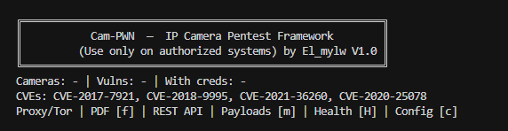
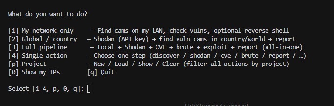

# Cam-PWN Framework

[](https://www.python.org/)
[](https://www.kali.org/)
[](#legal)

Production-oriented **IP camera penetration testing framework**. Primary platform: **Linux / Kali** (Metasploit, msfrpcd, etc.). Authorized use only. It combines Shodan discovery, CVE checks (e.g. CVE-2017-7921), RTSP/HTTP brute-force, custom exploits, Metasploit automation, reporting with maps, and optional C2/Burp/ZAP integration.

**Use only on systems you are explicitly authorized to test.**

---

## Quick Start (3 Steps)

1. **Install dependencies (Kali/Linux recommended)**
   ```bash
   bash scripts/install_kali.sh
   source venv/bin/activate
   ```
2. **Set minimum config**
   - Add your Shodan key in `config.yaml` (`shodan.api_key`) or export `CAM_PWN_SHODAN_KEY`
   - (Optional) add Metasploit password in `exploitation.metasploit_rpc_pass`
3. **Run the TUI**
   ```bash
   python main_tui.py
   ```

---

## Screenshots

> Add your screenshots under `docs/images/` and keep these names for GitHub rendering.




---

## Features

| Feature | Description |
|--------|-------------|
| **0. Local discovery** | Find cameras on the same network; shows your local IP and public IP |
| **1. Shodan** | API integration, geolocation filtering, SQLite storage, mass download |
| **2. CVE checks** | CVE-2017-7921, CVE-2018-9995 (Dahua), CVE-2021-36260 (Hikvision RCE), CVE-2020-25078; proxy-aware |
| **3. RTSP/HTTP brute-force** | Default creds + wordlist (RockYou), multi-threading, optional Tor/proxy |
| **4. Metasploit** | Reverse shell, cron/systemd persistence, credential harvesting |
| **5. Mass exploitation** | Multi-threaded CVE and exploit runs across DB cameras |
| **6. Reporting** | HTML report with Leaflet map, stats, optional PGP |
| **7. Custom payloads** | RFI, RTSP buffer overflow, firmware extraction, path traversal |
| **8. Plugins** | Camera-type plugins (Hikvision, Dahua, Foscam) and exploit plugins |
| **9. Burp / ZAP** | Send vulnerable endpoints to Burp proxy or ZAP API |
| **10. Storage** | SQLite with optional encryption; PGP for reports |
| **11. C2** | Optional C2 client for beacon registration and loot |
| **12. Statistics** | By country, product, firmware, honeypot counts |

---

## Where do the IPs come from?

- **Local discovery** — Same network as you: the tool scans your local subnet(s) and detects open camera ports (80, 554, 8080, etc.). Your **local IP(s)** and **public IP** are shown when you run `discover` or the TUI.
- **Shodan** — You run Shodan queries (e.g. `port:554 rtsp`); results are stored in the SQLite DB. Requires a Shodan API key.
- **Manual** — You can add targets to the database via the API/models if you extend the code.

All stored cameras are kept in `data/cam_pwn.db` (path set in `config.yaml`).

---

## Install

### Windows

```bash
cd cam-pwn-framework
python -m venv venv
venv\Scripts\activate
pip install -r requirements.txt
```

**Adding Python Scripts to PATH (optional):**  
If you use `pip install --user` and see warnings that scripts are not on PATH, add this folder to your user PATH:

- `%APPDATA%\Python\Python314\Scripts` (or your Python version)

Or run the framework with `python main.py` / `python main_tui.py` so you don’t need the Scripts directory on PATH.

### Kali Linux (recommended: use the install script)

```bash
cd cam-pwn-framework
bash scripts/install_kali.sh
source venv/bin/activate
```

The script installs: system packages (python3, pip, venv), venv, Python deps, data dirs (`data/wordlists`, `data/reports`, `data/screenshots`, `data/exports`), and optionally extracts RockYou.

**The installer does NOT download or install:** Metasploit, Empire, Covenant, or any C2 server; Shodan CLI; Burp Suite; OWASP ZAP. You use those tools separately if you want (e.g. run Metasploit yourself for reverse shells; get a Shodan API key from shodan.io; run Burp/ZAP and we send URLs to them).

### Generic Linux / macOS

```bash
cd cam-pwn-framework
python3 -m venv venv
source venv/bin/activate
pip install -r requirements.txt
```
```Windows
Command Prompt (cmd):
cd cam-pwn-framework
python -m venv venv
venv\Scripts\activate
PowerShell:
cd cam-pwn-framework
python -m venv venv
venv\Scripts\Activate.ps1
```
---

## Wordlists (RockYou on Kali)

For brute-force (RTSP/HTTP) the framework can use a wordlist. On **Kali Linux** the standard location is:

- **Path:** `/usr/share/wordlists/rockyou.txt`  
- If you only have the compressed file:  
  `sudo gunzip -k /usr/share/wordlists/rockyou.txt.gz`  
  (or install wordlists: `sudo apt-get install wordlists`)

In `config.yaml` you can set:

- `wordlist_path_kali`: `"/usr/share/wordlists/rockyou.txt"`  
- or `bruteforce.wordlist_path`: `"/usr/share/wordlists/rockyou.txt"`  

The TUI and CLI will use this path when you don’t pass `--wordlist`. If the path is missing, only built-in default credentials are used.

---

## Configuration

- **Shodan**: Set `CAM_PWN_SHODAN_KEY` or in `config.yaml` → `shodan.api_key`
- **DB encryption**: Set `CAM_PWN_DB_KEY`
- **Metasploit**: Set `exploitation.metasploit_rpc_pass` (or `CAM_PWN_MSF_PASS`). On Kali, msfrpcd at `/usr/bin/msfrpcd` is auto-started by [s] or [m]. Or run `msfrpcd -P <pass> -S -a 127.0.0.1 -p 55553` manually.
- **Burp**: `integrations.burp.enabled: true`, `integrations.burp.proxy`
- **ZAP**: `integrations.zap.enabled`, `base_url`, `api_key`
- **C2**: `c2.enabled`, `c2.endpoint`, `c2.api_key`
- **Wordlist**: `bruteforce.wordlist_path` or `wordlist_path_kali`. Auto-uses `/usr/share/wordlists/rockyou.txt` on Kali when present.
- **Tor / proxy**: In `config.yaml` add a `proxy` section. Used for CVE checks, Shodan, discovery.
- **Rate limiting / stealth**: `stealth.delay_ms` (e.g. 100–500) adds delay between requests for quieter scans. `stealth.request_timeout` sets HTTP/socket timeouts.

### Metasploit Password Setup (Required for MSF features)

Choose a password once (example: `pass123`) and use the **same value** in both places:

1. Set it in `config.yaml`:
   ```yaml
   exploitation:
     metasploit_rpc_pass: "pass123"
   ```
2. If you run manually, start `msfrpcd` with the same password:
   ```bash
   msfrpcd -P pass123 -S -a 127.0.0.1 -p 55553
   ```

Notes:
- If you use TUI `[s] Start MSF RPC` or `[m] Metasploit by CVE`, the framework tries to auto-start `msfrpcd` using `exploitation.metasploit_rpc_pass`.
- You can also use environment variable instead of config: `CAM_PWN_MSF_PASS=pass123`.

---

## Usage

### CLI

```bash
# Discover cameras on local network (shows local + public IP)
python main.py discover --local
python main.py discover --network 192.168.1.0/24

# Shodan: search and store in SQLite
python main.py shodan
python main.py shodan --query "port:554" --country DE --limit 500

# CVE checks on all cameras in DB
python main.py cve
python main.py cve --id 1 2 3 --workers 20

# RTSP brute-force (uses config wordlist or Kali path)
python main.py brute --rtsp
python main.py brute --rtsp --wordlist /usr/share/wordlists/rockyou.txt

# Run exploit
python main.py exploit --name rfi
python main.py exploit --name rtsp_buffer_overflow --workers 10

# HTML report with map
python main.py report --output data/reports/report.html

# Statistics
python main.py stats

# Send targets to Burp / ZAP
python main.py burp
python main.py zap
```

### TUI (workflow menu)

The TUI runs **by goal**: you pick what you want (my network / global / full pipeline) and it runs the right steps automatically.

```bash
python main_tui.py
```

**Main menu:**

- **[1] My network only** — Find cameras on your LAN → show local/public IP → CVE scan (e.g. CVE-2017-7921) → optional RTSP brute → optional exploit/reverse shell. For “find cams here and get in where possible”.
- **[2] Global / country** — Shodan (you need API key) → store results → CVE scan → brute → HTML report. For “find vulnerable cams in a country or worldwide”.
- **[3] Full pipeline** — Local discovery + optional Shodan + CVE + brute + exploit + report. All steps together; find everything (local + global) and get in where possible.
- **[4] Single action** — Pick one step (discover, Shodan, CVE, brute, exploit, report, stats, Burp, ZAP, view cameras+links, export IPs/creds, Export report to PDF [f], Metasploit by CVE [m], **Health check** [k], **Config check** [c], help).
- **[p] Project** — New / Load / Show / Clear. When a project is set, **all** actions (CVE, brute, exploit, report, views, exports) use only cameras tagged with that project.
- **[0]** Show my IPs (local + public). **[q]** Quit.

**Project:** Use **New project** (e.g. `client_x_gr`) then run discover or Shodan; new cameras are tagged. **Load project** picks from existing names in the DB. Stats, report, brute, exploit, and exports then filter by the current project.

**Filters:** Brute runs only on cameras with RTSP port and no existing credentials. In Single action → Exploit you can limit targets to cameras with a specific CVE (default: CVE-2017-7921).

**Progress:** CVE scan, brute, and exploit show a tqdm progress bar when running.

**Screenshots:** After brute finds credentials, snapshot images are saved under `storage.screenshots_dir`. Optional full web UI screenshots: install `playwright` and run `playwright install chromium`, or use `selenium` with chromedriver; see `cam_pwn.screenshots.capture_screenshot_headless`.

**PDF report:** In Single action choose **[f] Export report to PDF**. Requires `weasyprint` (in `requirements.txt`). Generates HTML then converts to PDF.

---

## REST API

A small FastAPI server lets you run discover, Shodan, CVE scan, and reports from scripts or another UI.

```bash
# Start the API (from project root, with venv active)
uvicorn cam_pwn.api_server:app --host 0.0.0.0 --port 8000
# or: python -m cam_pwn.api_server
```

**Endpoints:**

| Method | Path | Description |
|--------|------|-------------|
| GET | `/health` | Health check |
| GET | `/cameras?project=&limit=500` | List cameras (optional project filter) |
| GET | `/stats?project=` | Statistics by project |
| POST | `/discover?project=` | Run local discovery |
| POST | `/shodan` | Body: `{"api_key":"...", "limit":500, "country":"DE", "project":"..."}` |
| POST | `/cve-scan` | Body: `{"project":"...", "max_workers":20}` |
| POST | `/report` | Body: `{"project":"...", "title":"..."}` → HTML report path |
| POST | `/report/pdf` | Same body → PDF report path (requires weasyprint) |

---

## Project layout

```
cam-pwn-framework/
├── .gitignore
├── config.yaml
├── main.py              # CLI
├── main_tui.py           # Interactive TUI menu
├── requirements.txt
├── scripts/
│   ├── install_kali.sh   # Kali Linux install (deps + venv + data dirs + rockyou)
│   └── ensure_dirs.py    # Ensure data/wordlists, reports, screenshots, exports exist
├── cam_pwn/
│   ├── config.py
│   ├── kali_paths.py    # Kali/Linux default paths (wordlist, reports, DB)
│   ├── http_client.py   # Shared session + proxy (Tor) for CVE/Shodan
│   ├── api_server.py    # REST API (FastAPI)
│   ├── network_utils.py # local IP, public IP
│   ├── discovery.py
│   ├── shodan_client.py
│   ├── cve_checks.py
│   ├── rtsp_bruteforce.py
│   ├── metasploit_client.py
│   ├── c2_client.py
│   ├── mass_exploit.py
│   ├── reporting.py
│   ├── integrations.py
│   ├── db/
│   ├── exploits/
│   └── plugins/
└── data/
    ├── wordlists/
    └── reports/
```

---

## Known Limitations

- **Authorization required**: this framework is for authorized security testing only.
- **Metasploit is optional**: core discovery/CVE/brute/report features run without MSF; reverse-shell workflows require `msfrpcd`.
- **Shodan depends on API quota/key**: limited or missing key reduces global discovery capabilities.
- **Heuristic checks**: some CVE and honeypot detections are best-effort and may produce false positives/negatives.
- **Environment dependencies**: PDF export needs `weasyprint`; browser screenshots need Playwright/Selenium setup.

---

## Legal

Use only on networks and devices you are authorized to test. Unauthorized access is illegal.
